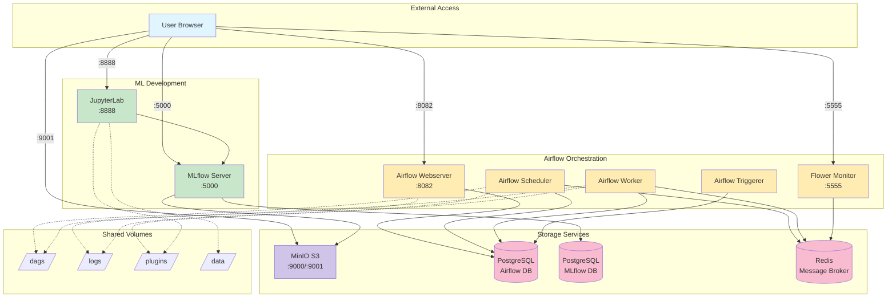

# MLOps Boilerplate : A streamlined environment for MLOps projects.

This README provides a concise guide to setting up and managing your MLOps environment, including service URLs and credentials in an easy-to-read table format.

## Architecture



## Disclaimers
Building the environment may take some time. You might consider take a brake with a kit-kat or take some time to read the `docker-compose.yml` file.

Remember that the environment shoould be managed from the `/dockerfile` folder. This mean for example that the notebook should be run from within jupyter and not out of it.

If you need to deploy several model, you need to create another context folder in `pluggins/cd4ml/deploy_model` and connect the latter to airflow somehow (since the pipelines are managed from airflow).

> The minimum requirements for your VM: 16Gb RAM, 32Gb storage

## Initialization
Run the following commands to set up everything:

```sh
make init-airflow
make start
```

## Running after a first run
Run

```sh
make start
```


## Services
Here is a list of the services provided, including their URLs and credentials:

| Services          | URL                       | Credentials           |
|------------------|---------------------------|-----------------------|
| Airflow          | http://localhost:8082     | airflow/airflow       |
| JupyterLab       | http://localhost:8888     | Token: cd4ml          |
| MLflow           | http://localhost:5000     | -                     |
| MinIO S3 server  | http://localhost:9001     | mlflow_access/mlflow_secret |
| Flower (Celery)  | http://localhost:5555     | -                     |

## Cleanup
To stop all running Docker containers, press `Ctrl+C` and run:

```sh
make stop
```

To delete all running Docker containers and images:

```sh
make del-containers-and-images
```

## Resources
1. [MLflow Docker Compose Setup](https://github.com/sachua/mlflow-docker-compose)
